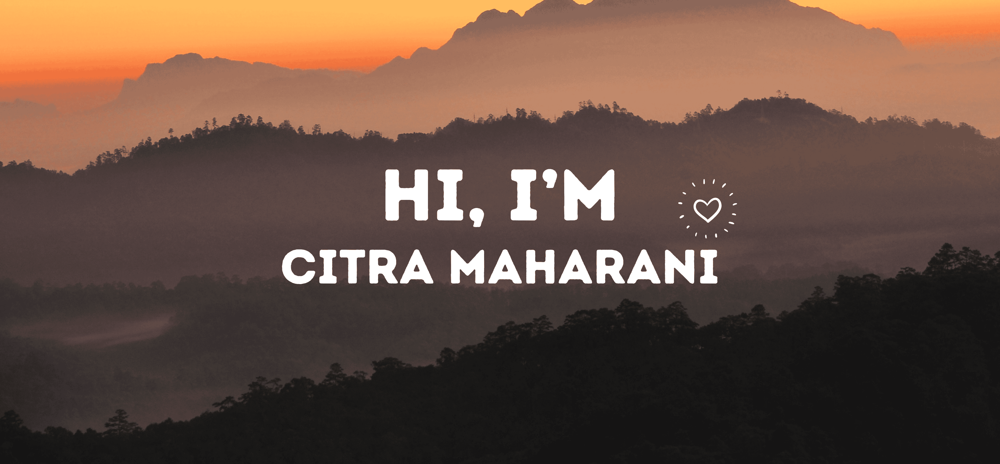

## 

<h3 align="center">I am a student of Information System who playing around with web for the last 1 year of focused. I have learnt Laravel and currently excited in React. I have so many interests❤️ including Machine Learning and UI/UX. Glad to find u here, let's be friend😇</h3>

- 🌱 I’m currently learning **React, Python, Machine Learning, Deep Learning**

- 👨‍💻 Check my [Portfolio](https://citrammaharani.netlify.app/)

- 📫 How to reach me **agungcitra2717@gmail.com**

- 📄 Know about my experiences [Resume](https://drive.google.com/file/d/1cZbEU6iELAIu3Xm1ccBYcbROLZgCMnR1/view?usp=sharing)

## 🌐 Socials:
  

# 💻 Tech Stack:
            !

# 📊 GitHub Stats:

## 🏆 GitHub Trophies

### ✍️ Random Dev Quote

<!-- ### 🔝 Top Contributed Repo
 -->

<h2 align="center">Thank U for Coming Here!😊</h2>
